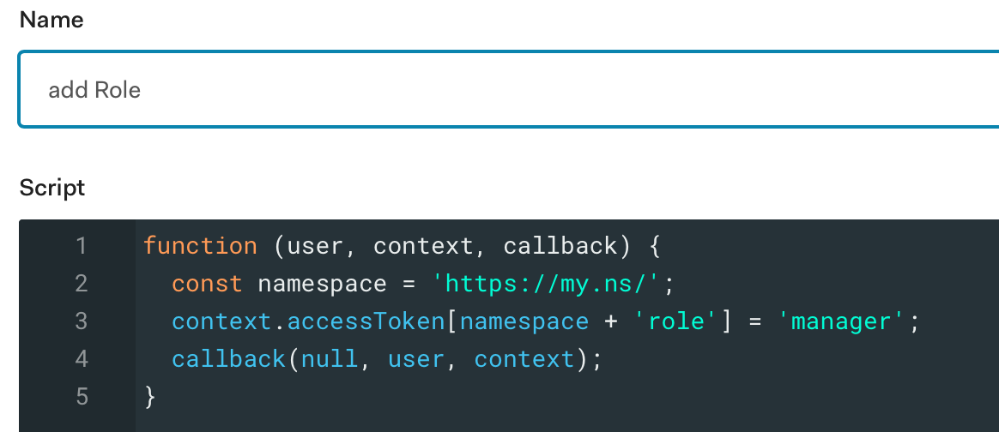
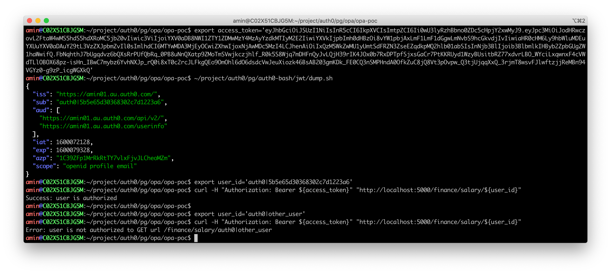
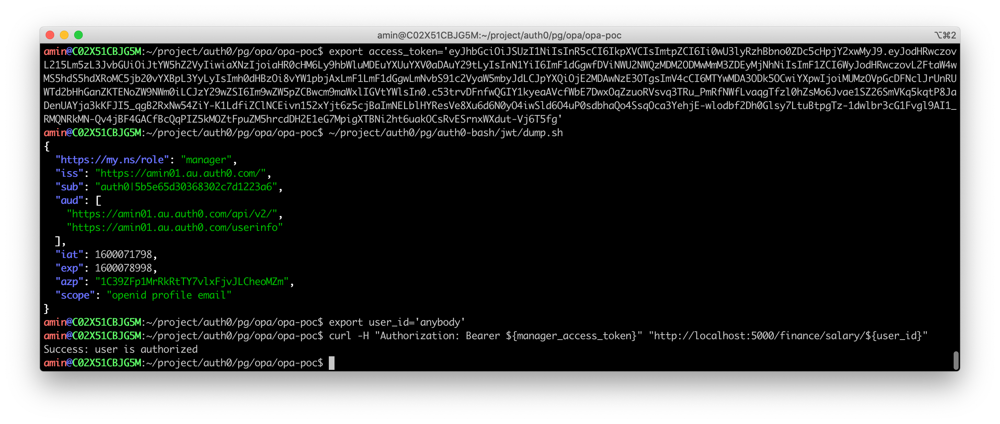

# Run OPA Overlay Mode with Auth0 JWT access_token for FGA entitlement 

Simple policy to allow each user to access only their own salary, however manager users (with claim `https://my.ns/role` equal to `manager`) can read evey salary.

# Setup

## OPA

```bash
opa run -s simple.rego
```

## Overlay Facade
```bash
export FLASK_APP=./facade.py
flask run --host 127.0.0.1
```

## Auth0 Rule


# Test

```bash
export access_token=.....
export user_id='auth0|xxxx'
curl -H "Authorization: Bearer ${access_token}" \
  "http://localhost:5000/finance/salary/${user_id}"
```


## Demo

### Access with Normal JWT


### Access with Manager JWT

